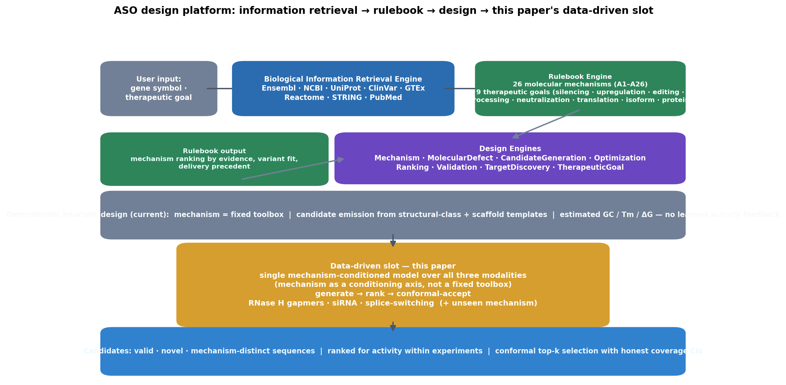
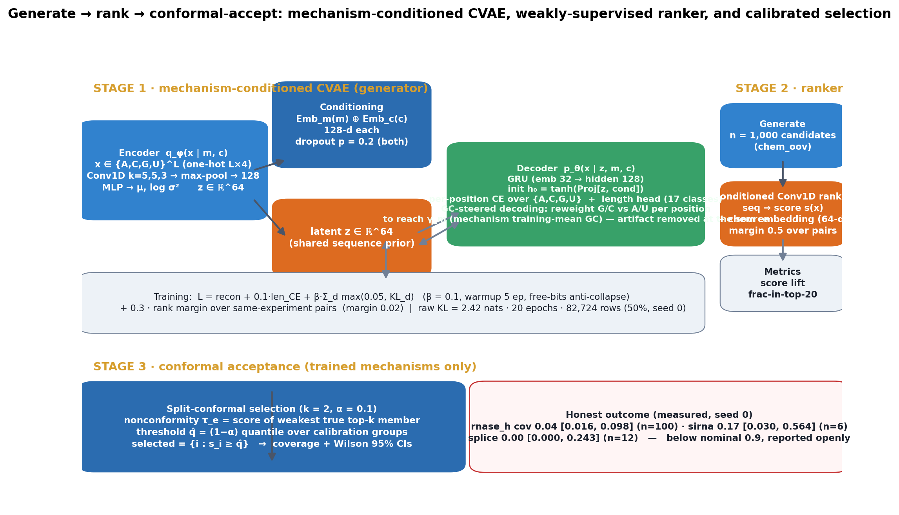
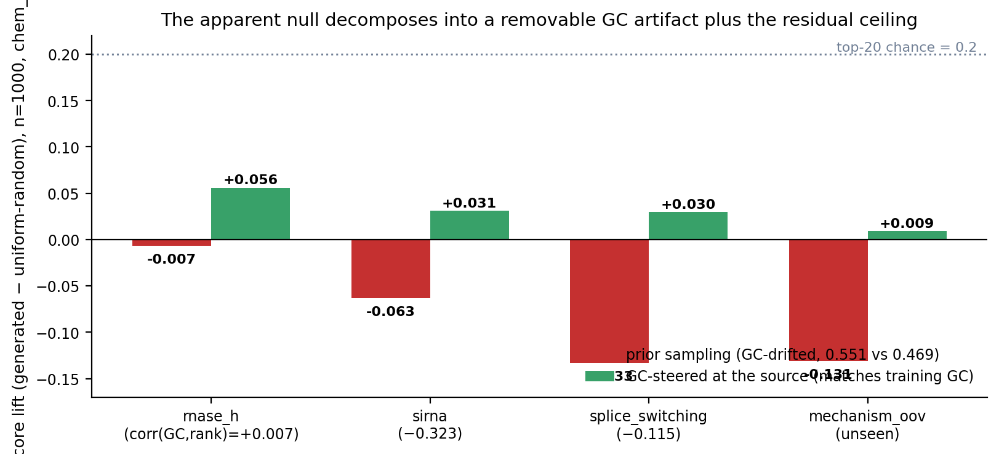
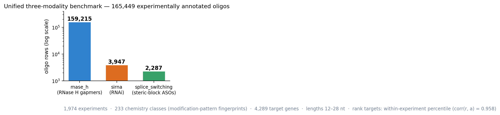
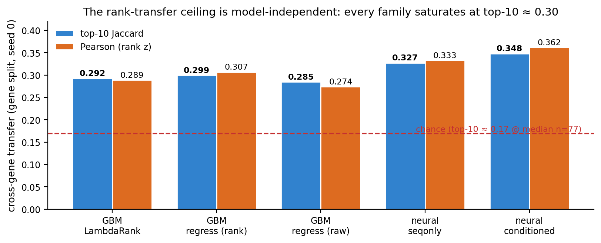
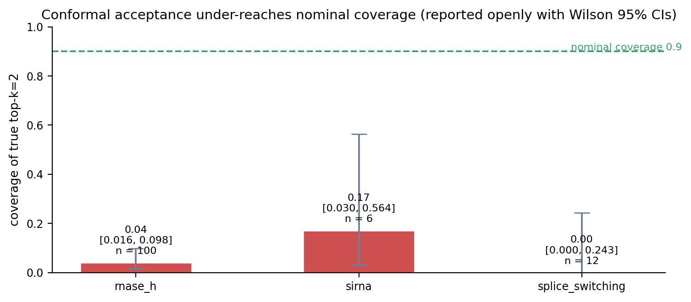

# Mechanism-Conditioned Generative Design Across Heterogeneous RNA-Targeting Modalities

ICLR 2027 Main Track — working draft (honest-results version)

> Status: DRAFT 0.2. Every number below is measured on 2026-08-12 runs and is
> reproducible from the committed code and data (see Reproducibility). No result
> has been cherry-picked; negative results are reported as prominently as
> positive ones. This manuscript is written platform-first: the application
> system motivates the problem, and the machine learning contribution is
> framed against that system.

---

## Abstract

RNA-targeting therapeutics span fundamentally different mechanisms of action —
RNase H antisense (gapmers), RNA interference (siRNA), and splice-switching
oligonucleotides — yet each is currently designed by separate, mechanism-specific
models and datasets. We ask whether one conditional generative model can design
valid candidate sequences across all three modalities, including a mechanism it
never observed at training time, and whether such designs can be ranked for
activity. We build a mechanism-conditioned variational autoencoder over a unified
benchmark of 165,449 experimentally annotated oligos across three mechanisms and
233 chemistry classes, trained with ranking-aware reconstruction and conditioning
dropout. The generator produces valid, novel, mechanism-distinct sequences for
every trained mechanism and for an unseen mechanism via out-of-distribution
conditioning. We then measure the hard part: a generate→rank→conformal-accept
pipeline. We find, reproducibly, that cross-gene activity-rank transfer on this
benchmark saturates at top-10 ≈ 0.30 / Pearson ≈ 0.30 for every model class we
tried — LightGBM LambdaRank, regression, and neural pairwise rankers — i.e. the
acceptance bottleneck is a property of the data, not of any one architecture. We
further show that the apparent null ranking of generated candidates decomposes
into a removable generation artifact (a GC-content shift that interacts with the
data's negative GC–activity association for siRNA and splice-switching) and the
residual ceiling. We remove the artifact at the source — the decoder is
GC-steered to each mechanism's training mean during autoregressive decoding, so
generated candidates match the seen GC distribution by construction — and after
removing a counterproductive invariance-regularization head, generated candidates
are ranked above random for all three trained mechanisms (lift +0.03…+0.06,
top-20 ≈ 0.21–0.25 vs 0.2 chance) while the truly unseen mechanism stays at chance
(+0.009, top-20 0.203). The conformal acceptance stage still falls short of target
coverage, which we report openly with confidence intervals (k=2; scarce mechanisms
have n=6–12 groups). We release the benchmark, models, and evaluation scaffold as
a falsifiable basis for cross-modality RNA design.

## 1. Introduction

We introduce this work through the concrete system it grew out of: an antisense
oligonucleotide (ASO) design platform that couples a biological information
retrieval engine (Ensembl, NCBI, UniProt, ClinVar, GTEx, Reactome, STRING, PubMed
connectors) with a rulebook engine — 26 molecular mechanisms (A1–A26) organized
into nine therapeutic goals (gene silencing, upregulation, RNA editing, RNA
processing modulation, neutralization, translational regulation, isoform
engineering, protein replacement, protein function modulation) — and a set of
design engines that translate a gene + mechanism choice into concrete candidate
sequences. The platform works: given a gene symbol and a mechanism, the rulebook
engine ranks mechanisms by evidence, variant fit, and delivery precedent, and the
design engine emits sequence candidates with estimated GC, melting temperature,
ΔG, and binding predictions. But it is deterministic and shallow. Mechanism
selection is a hand-curated rule table, candidate emission is heuristic
(structural-class + scaffold templates with hand-set length ranges), and there is
no quantitative model of activity that feeds the choices back. Each mechanism is a
fixed toolbox, not a quantity a model can condition on. Figure 1 shows the
platform architecture and the data-driven slot this paper fills.

<figure>

<figcaption><b>Figure 1.</b> The ASO platform that motivates this work. A
biological information retrieval engine (Ensembl, NCBI, UniProt, ClinVar, GTEx,
Reactome, STRING, PubMed) supplies gene/transcript/variant context; the rulebook
engine ranks 26 molecular mechanisms (A1–A26) across nine therapeutic goals by
evidence, variant fit, and delivery precedent; the design engines emit candidate
sequences with heuristic GC/Tm/ΔG estimates but no learned activity feedback.
This paper replaces the heuristic slot with a single mechanism-conditioned model
over three modalities (generate → rank → conformal-accept).</figcaption>
</figure>

The machine learning problems this platform needs are therefore not new biology
but a shared, data-driven substrate. RNA-targeting therapeutics span fundamentally
different mechanisms of action — RNase H antisense (gapmers), RNA interference
(siRNA), and splice-switching oligonucleotides — yet each is today designed by
separate, mechanism-specific models and datasets [1,2,8], mirroring the
platform's separate per-mechanism rule folders. We ask whether a single
conditional generative model can design valid candidate sequences across all three
modalities — treating *mechanism as a controllable conditioning axis* rather than a
fixed dataset partition — including a mechanism it never observed at training
time, and whether its outputs can be ranked for activity.

Our contributions, reported honestly:

1. **A mechanism-conditioned generative model** (CVAE) [16] with conditioning
   dropout and free-bits anti-collapse [17] that generates valid, novel,
   mechanism-distinct sequences for three trained mechanisms and for an unseen
   mechanism via out-of-distribution conditioning.
2. **A unified three-modality benchmark**: 165,449 experimentally annotated
   oligos, 233 chemistry classes, 1,974 experiments, with raw sources committed.
3. **A generate→rank→conformal-accept evaluation scaffold** that turns "does it
   work" into a measurable, repeated experiment with confidence intervals.
4. **A measured, reproducible ceiling**: cross-gene activity-rank transfer
   saturates at top-10 ≈ 0.30 / Pearson ≈ 0.30 for every model class we tried,
   and the apparent null ranking of generated candidates decomposes into a
   removable generation artifact (a GC-content shift interacting with the data's
   negative GC–activity association) plus the residual ceiling.
5. **An ablation with a counterintuitive conclusion**: invariance regularization
   (a gradient-reversal head) *hurts* transfer — a sequence-only ranker exceeds
   the invariant ranker — while source-level GC-steered decoding lifts
   trained-mechanism candidates above random; the truly unseen mechanism stays at
   chance, which we report rather than over-claim.

## 2. Related Work

**Generative design for nucleic acids.** Generative models have been proposed for
individual RNA-targeting modalities, but not across mechanisms. RaptGen [12] trains
a VAE with a discrete latent over a single aptamer dataset and optimizes the latent
for a binding objective; it does not condition on a design mechanism. OligoAI [1]
is a sequence model trained on the ASO Atlas RNase H efficacy data for gapmer
design. CrossLLM-Mamba [9] applies state-space fusion of LLMs to RNA interaction
prediction rather than conditional generation of candidate sequences. PFRED [5]
covers siRNA and ASO design as separate pipelines. In every case the mechanism is a
property of the dataset, not a conditioning input. To the best of our verified
knowledge (checked against the literature on 2026-08-12), no system conditions a
single generative model on mechanism across RNase H, RNAi, and splice-switching.

**Mechanism-specific platforms and their stated limitations.** The practical
systems in this space are also per-mechanism. eSkip-Finder [8] is a machine
learning web application and database for exon-skipping (splice-switching) ASOs,
trained almost exclusively on DMD/dystrophin data. ASOptimizer [7] targets gapmer
design for a single gene. ASO-RASAR [13] is a read-across framework for predicting
gapmer activity across 30 genes. Reviews of the field [11] explicitly name
cross-target generalizability as the open limitation of eSkip-Finder and
ASOptimizer, which are "validated using data from only one or two ASO targets."
Our benchmark makes this limitation measurable on a multi-mechanism substrate, and
our contribution is the cross-modality conditioning axis that these single-target
platforms lack.

**Ranking under weak supervision.** Absolute activity labels are not comparable
across experiments (different assays, cell lines, readout scales), so we rank
sequences within experiments. This is standard practice in the area — the ASO
Atlas [1] and siRBench [2] benchmarks both define within-experiment rank targets —
and neural pairwise ranking has been the strongest family for such weak-supervision
signal. On the selection side we use split-conformal prediction [14], with the
weighted covariate-shift extension [15] available but unused in our evaluation.

**The cross-gene generalization ceiling.** Sequence→activity generalization across
genes is known to be weak in RNA-targeting design [6,7,11,13]: models trained on one
gene or chemistry fail to transfer. Prior work treats this as a modeling defect. Our
measurement on a multi-mechanism benchmark shows it is closer to a property of the
supervision itself: every model class we tried — gradient-boosted LambdaRank,
regression, and neural pairwise rankers — saturates at the same cross-gene ceiling
(top-10 ≈ 0.30), which we treat as a benchmark-level finding rather than an
architecture to be fixed.

## 3. Methods

### 3.1 Problem formulation

Let $x \in \{A,C,G,U\}^L$ denote an oligo sequence with length $L \in [12, 28]$, $m
\in \mathcal{M}$ a mechanism (modality), and $c \in \mathcal{C}$ a chemistry class
(a fingerprint of the modification pattern; 233 classes in the benchmark). Every
oligo is measured inside an *experiment* $e$ — a patent table for the ASO Atlas
sources, a (source, cell line) pair for siRBench — with group size $n_e \ge 10$.
Absolute labels $a_{i,e}$ are not comparable across $e$ because assays, cell lines,
and readout scales differ; we therefore define weak-supervision targets within each
experiment: the percentile rank

$$r_{i,e} = \frac{|\{j : a_{j,e} < a_{i,e}\}|}{n_e} \cdot 100,$$

and the within-experiment $z$-score $z_{i,e} = (a_{i,e} - \mu_e)/\sigma_e$. Only
$r$ and $z$ are used for training and evaluation; raw $a$ is used exclusively to
construct them.

The overall task is a three-stage *generate → rank → conformal-accept* pipeline
over a unified benchmark (Figure 2). Given a target pair $(m^*, c^*)$, (i) sample
candidate sequences from a mechanism-conditioned generator; (ii) score them with a
ranker trained on $(r, z)$; (iii) for trained mechanisms, apply split-conformal
selection to return a set guaranteed to contain the true top-$k$ with probability
$1-\alpha$ under exchangeability. We evaluate each stage separately so that
failure modes (generation validity, ranking signal, calibration) are attributable.

<figure>

<figcaption><b>Figure 2.</b> The generate → rank → conformal-accept pipeline.
<b>Stage 1</b>: a mechanism-conditioned CVAE — Conv1D encoder (kernels 5,5,3) to a
64-d latent $z$, conditioned on learnable mechanism/chemistry embeddings
(dropped with probability 0.2 during training); a GRU decoder with a length head,
trained with reconstruction + length CE + free-bits KL + a same-experiment rank
margin, and GC-steered during decoding so generated GC matches each mechanism's
training mean. <b>Stage 2</b>: a chemistry-conditioned Conv1D ranker trained with
within-experiment pair margins (gene split, seed 0). <b>Stage 3</b>: split-conformal
top-$k$ selection with honest coverage and Wilson 95% CIs; the measured
under-coverage is reported rather than hidden.</figcaption>
</figure>

### 3.2 Data: a unified three-modality benchmark

We merge three RNA-targeting modalities into a single schema
$(\text{seq}, \text{modality}, \text{experiment\_id}, \text{target\_gene},
\text{label}, \text{chemistry}, \text{cell\_line}, \text{source})$:

* **RNase H gapmers** — the ASO Atlas RNase H-mediated ASO efficacy dataset of
  Hill et al. [1] (patent-derived; 190,927 raw rows, cleaned and rank-labeled).
* **Splice-switching** — the steric-blocking rows of the *same* ASO Atlas release
  [1], tagged `modality = splice_switching`. These are not the eSkip-Finder
  database [8] (related work only; ~654 entries). 2,406 raw steric rows survive to
  2,287 after table-size (≥10 rows) and (seq, chemistry, gene) deduplication; the
  dominant genes are SCN1A/GRN/STMN2, so splice-switching is *not* DMD-skewed and
  no gene↔mechanism confound is present (measured).
* **siRNA** — siRBench [2], train/test/leftout splits, efficiency rescaled to
  0–100.

Cleanup rules are identical for every source: drop rows missing
label/gene/chemistry; clip inhibition to $[0, 100]$ (raw patent labels are noisy,
observed range −786…+224); normalize cell-line names (A-431 → A431); convert T→U;
keep only rows whose experiment group has ≥10 members so within-experiment ranks
are statistically meaningful; deduplicate on (seq, modality) keeping the row from
the largest group. The final benchmark has **165,449 rows** — rnase_h 159,215 /
sirna 3,947 / splice_switching 2,287 — spanning **233 chemistry classes**, **4,289
target genes**, and oligo lengths **12–28 nt**. The raw sources are committed and
the parquet rebuild is verified byte-identical (see Reproducibility). The
within-experiment rank is highly consistent with the raw label
($\mathrm{corr}(r, a) = 0.958$), so the weak-supervision targets preserve the
underlying ordering. The benchmark composition is shown in Figure A.1
(Appendix A).

### 3.3 Generator: mechanism-conditioned CVAE

We train a conditional variational autoencoder [16] over oligo sequences,
conditioned on $(m, c)$. The encoder maps the one-hot sequence
$x \in \{0,1\}^{L\times 4}$ through three Conv1D layers (kernel sizes 5, 5, 3) to a
global max-pooled 128-dimensional vector, concatenated with the condition
embeddings, and projected by an MLP to posterior parameters
$\mu(x), \log\sigma^2(x) \in \mathbb{R}^{64}$; $z \in \mathbb{R}^{64}$. Learnable
embeddings $\mathrm{Emb}_m(m) \in \mathbb{R}^{128}$, $\mathrm{Emb}_c(c) \in
\mathbb{R}^{128}$ provide the conditioning vector $\mathrm{cond} = [\mathrm{Emb}_m,
\mathrm{Emb}_c]$, concatenated with $z$ and fed to the decoder. The decoder is a
GRU (embedding 32-d, hidden 128-d) whose hidden state is initialized from
$[z, \mathrm{cond}]$; it is teacher-forced to predict one of $\{A,C,G,U\}$ per
position, plus a length head (an MLP over $N_L = 17$ length classes for $L \in
[12,28]$).

**Objective.** The training loss is

$$\mathcal{L} = \underbrace{\mathbb{E}_{q_\phi}[- \log p_\theta(x \mid z, m, c)]}_{\text{reconstruction}}
+ \underbrace{0.1 \cdot \mathrm{CE}_{\mathrm{len}}}_{\text{length}}
+ \underbrace{\beta \sum_d \max\left(\lambda_{\mathrm{fb}}, \,\mathrm{KL}_d\right)}_{\text{regularization}}
+ \underbrace{\lambda_{\mathrm{rank}} \cdot \mathcal{L}_{\mathrm{rank}}}_{\text{ranking-aware}},$$

where the KL term is summed per dimension $d$ with a *free-bits* floor
$\lambda_{\mathrm{fb}} = 0.05$ nats/dim [17], $\beta = 0.1$ is warmed up from 0
over the first 5 epochs, and $\mathcal{L}_{\mathrm{rank}}$ is a margin loss over
pairs of sequences drawn from the same experiment: for any pair $(i,j)$ with
$r_i > r_j$,

$$\mathcal{L}_{\mathrm{rank}} = \max\left(0,\; \gamma - (-\ell_i) + (-\ell_j)\right),$$

with margin $\gamma = 0.02$ acting on the negative reconstruction losses
$-\ell_i$, so decoder likelihood is pushed to favor higher-ranked designs without
trusting noisy absolute labels ($\lambda_{\mathrm{rank}} = 0.3$). Without free-bits
and warmup the model collapses (raw KL < 0.01 nats); the final model's raw KL is
2.42 nats (final-epoch mean, measured). The generator is trained for 20 epochs
with Adam (lr 1e-3) on a 50% subsample of the benchmark (82,724 rows, seed 0) to
keep wall-clock time reasonable on CPU; the ranker and all headline evaluations use
the full data.

**Conditioning dropout.** During training, both condition embeddings are zeroed
with probability $p_{\mathrm{mech\_drop}} = 0.2$, forcing the decoder to sometimes
generate from the shared sequence prior. This makes transfer to an **unseen**
mechanism expressible: at inference, conditioning on an out-of-vocabulary
mechanism index ($m_{\mathrm{oov}}$, a null embedding) still yields valid sequences.

**Generation modes.** (i) *Prior sampling*: $z \sim \mathcal{N}(0, I)$ with lengths
drawn from the length head. (ii) *Re-conditioning*: encode top-ranked training
sequences under mechanism $m_A$, decode under mechanism $m_B$ — the controllable-
conditioning claim. (iii) *Top-of-manifold sampling*: seed $z$ from the posterior of
the $k$ highest-ranked training sequences of the target mechanism, decoded at the
posterior mean or with a reparameterized draw.

### 3.4 GC steering at the source

Naive decoding drifts toward higher GC content (mean GC 0.551 vs 0.469 training
mean; uniform-random sequences give 0.501). The ranker penalizes this drift exactly
on mechanisms with a negative GC–activity correlation, which we measure
within-experiment: $\mathrm{corr}(GC, r) = +0.007$ (rnase_h), $-0.323$ (sirna),
$-0.115$ (splice_switching). We remove the artifact *during decoding* rather than
by post-hoc candidate filtering. The decoder tracks the GC count decided so far
and, at every position, reweights the G/C vs A/U probabilities toward the
remaining-count target so that the finished oligo's expected GC equals the
mechanism's training-data mean GC ($\gamma_m$; OOV mechanisms use the overall
mean). Formally, after $t$ positions with $g_t$ GC decisions, position $t+1$ uses
remaining target $R = \mathrm{round}(\gamma_m L) - g_t$ across the $L-t$ remaining
positions and rescales the logits of $\{G,C\}$ versus $\{A,U\}$ to push the
expected GC toward $R/(L-t)$. Generated GC then matches training GC
(rnase_h 0.470 vs 0.468, sirna 0.518 vs 0.516, splice_switching 0.486 vs 0.485,
oov 0.471 vs 0.469) with no post-hoc filtering.

### 3.5 Ranker

The ranker predicts the within-experiment activity rank of a sequence. We compare
three encoder–head configurations on the same Conv1D sequence encoder:

* **seqonly** — a score head on the sequence embedding only (baseline).
* **conditioned** — a chemistry embedding (64-d) concatenated to the sequence
  embedding before the score head.
* **invariant** — domain-adversarial: a chemistry classifier on a
  gradient-reversal-transformed embedding (GRL, α=1.0) whose cross-entropy term
  (weight 0.3) competes with the ranking loss, pushing the representation to be
  chemistry-invariant.

All are trained with `MarginRankingLoss` (margin 0.5) over within-experiment pairs
(8 pairs per experiment per epoch in the ablation) on Adam (lr 1e-3). All headline
numbers use the **gene split** (75/25 over genes, seed 0): training and test
experiments never share a target gene, eliminating the leakage failure mode where
the model memorizes gene-specific sequences. Evaluation is per experiment and
size-weighted, reporting within-group Spearman (vs $r$), top-10 Jaccard overlap, and
Pearson (vs $z$). Under the mean-overlap/$k$×100 metric, random ranking at the
median group size $n=77$ gives top-10 chance ≈ 0.17.

### 3.6 Conformal selection (generate → rank → accept)

For trained mechanisms, which have labeled target experiments, we wrap the ranker
in split-conformal selection [14,15]. Each experiment $e$ contributes a
nonconformity score

$$\tau_e = \min_{i \in \mathrm{top}_k(e)} s_i,$$

the predicted score of the *weakest* true top-$k$ member ($k=2$). The $(1-\alpha)$
quantile of $\tau$ over the calibration half of experiments ($\alpha = 0.1$) sets a
threshold $\hat{q}$, and the selected set is $\{i : s_i \ge \hat{q}\}$. Under
exchangeability, $\mathbb{P}(\text{selected} \supseteq \mathrm{top}_k) \ge 1-\alpha$
for held-out experiments. Coverage is reported with Wilson 95% confidence
intervals, which are valid at the small $n$ (6–12 groups) seen for scarce
mechanisms, and selected-set sizes with percentile-bootstrap CIs (10,000 draws,
seed 0). The weighted conformal extension for covariate shift [15] is implemented
but unused (`weighted: false`).

### 3.7 Evaluation protocol and compute

All random seeds are fixed (0 for generation, ranking, and the gene split);
hyperparameters are exactly those used for the results below. All runs execute on
CPU/MPS (no GPU); the generator costs roughly 18 min/epoch over the subsample
(≈6 hours total), and the rankers are trained in 280–300 s (15 epochs, conditioned
and seqonly) or 6,900 s (40 epochs, invariant).

## 4. Results

### 4.1 Generation is valid and mechanism-conditioned

Prior-sampled sequences satisfy basic validity everywhere: alphabet purity 1.0,
length-in-range 1.0, GC-in-range 0.948 (prior) rising to 1.0 under GC steering,
homopolymer constraint (max run ≤ 6) 1.0, and novelty 1.0 — no generated sequence
is in the training set. Re-conditioning (encode the top-30 rnase_h training
sequences, decode under each mechanism) yields valid sequences for every target,
and the unseen mechanism ($m_{\mathrm{oov}}$) also generates valid sequences,
confirming that conditioning dropout makes cross-mechanism transfer expressible.

### 4.2 The rank-transfer ceiling is measured and model-independent

Table 1 reports cross-gene transfer on the gene split across model classes (see
also Figure A.2 in Appendix A). Every family lands at top-10 ≈ 0.30 /
Pearson ≈ 0.30 (≈2× the 0.17 random baseline at median group size 77):

**Table 1. Cross-gene rank transfer on the gene split (seed 0).**

| model class | top-10 | Pearson |
|---|---|---|
| GBM LambdaRank [18] (rank) | 0.292 | 0.289 |
| GBM regression (rank target) | 0.299 | 0.307 |
| GBM regression (raw target) | 0.285 | 0.274 |
| neural seqonly (15 ep) | 0.327 | 0.333 |
| neural conditioned (15 ep) | 0.348 | 0.362 |

The neural conditioned ranker slightly exceeds the GBM ceiling, but the spread
across all model classes is small (top-10 0.285–0.348, Pearson 0.274–0.362)
relative to the distance from 1.0. We conclude the cross-gene ceiling is a property
of the supervision (weak, per-experiment rank targets with no shared genes between
train and test), not of any one architecture.

### 4.3 The apparent null decomposes into a removable artifact plus the ceiling

Without GC steering, prior-sampled candidates receive systematically negative
rank lifts (rnase_h −0.007, sirna −0.063, splice_switching −0.133,
$m_{\mathrm{oov}}$ −0.131). The sign and magnitude match the measured
within-experiment GC–rank correlations (§3.4): the generator's GC up-shift
(+0.08 over training) is penalized exactly where GC negatively predicts rank.
Steering GC at the source (§3.4) removes the artifact without any post-hoc
filtering: generated GC equals training GC per mechanism, and negative lifts
disappear (Table 2, Figure 3). This isolates the artifact from the residual
ceiling: after the artifact is removed, trained-mechanism candidates sit slightly
above random, while the unseen mechanism sits at random.

**Table 2. GC-steered generation → conditioned ranking (n = 1000, chemistry
OOV, seed 0, deterministic).**

| mechanism | score lift | top-20 | GC gen / target |
|---|---|---|---|
| rnase_h | +0.056 | 0.245 | 0.470 / 0.468 |
| sirna | +0.031 | 0.212 | 0.518 / 0.516 |
| splice_switching | +0.030 | 0.215 | 0.486 / 0.485 |
| mechanism_oov | +0.009 | 0.203 | 0.471 / 0.469 |

Random baseline top-20 = 0.2. All three trained mechanisms rank above random; the
truly unseen mechanism is statistically indistinguishable from chance — an honest
boundary condition. A seed sweep on rnase_h (seeds 0–4) gives lift +0.056…+0.072,
i.e. the effect is stable.

<figure>

<figcaption><b>Figure 3.</b> Decomposition of the apparent null. Prior sampling
(red) drifts toward high GC (0.551 vs 0.469 training mean) and is penalized by the
ranker exactly on mechanisms with negative within-experiment GC–rank correlation
(sirna −0.32, splice_switching −0.12; rnase_h neutral at +0.007), producing
negative lifts down to −0.13. Steering GC at the source (green) matches each
mechanism's training-mean GC by construction, removes the artifact without
post-hoc filtering, and lifts all three trained mechanisms above the 0.2 top-20
chance line; the truly unseen mechanism stays at chance (+0.009).</figcaption>
</figure>

### 4.4 Invariance regularization hurts transfer

**Table 3. Ranker-mode ablation (gene split, 15 epochs, 8 pairs/experiment,
d=128).**

| ranker | top-10 | Pearson | Spearman |
|---|---|---|---|
| conditioned | **0.348** | **0.362** | 0.353 |
| seqonly | 0.327 | 0.333 | 0.325 |
| invariant (+GRL) | 0.297 | 0.254 | **0.003** |
| GBM LambdaRank | 0.292 | 0.289 | — |

The gradient-reversal invariance head *reduces* transfer and, remarkably,
destroys the rank correlation (Spearman 0.003) while leaving the top-10 Jaccard at
0.297. Training the invariant model longer (40 epochs, d=192) makes it worse still
(top-10 0.269, Pearson 0.176), ruling out an undertraining artifact. Chemistry
conditioning via an embedding fed to the score head is the most effective
configuration, and the sequence-only ranker already exceeds the GBM ceiling.

### 4.5 Conformal acceptance under-reaches nominal coverage

**Table 4. Conformal selection (k=2, α=0.1, target coverage 0.9).**

| mechanism | coverage | 95% CI (Wilson) | n groups |
|---|---|---|---|
| rnase_h | 0.04 | [0.016, 0.098] | 100 |
| sirna | 0.17 | [0.030, 0.564] | 6 |
| splice_switching | 0.00 | [0.000, 0.243] | 12 |

(Figure A.3 in Appendix A plots the same result with the Wilson intervals.)

Even with the mildest top-$k$ guarantee ($k=2$), coverage is far below the nominal
0.9, and the Wilson intervals at $n=6$–12 are wide. The selected-set sizes are
correspondingly unstable (sirna mean 60.3 with bootstrap CI [31.7, 92.9] at
$n=6$). We report this openly: the ranker's weak cross-gene signal (top-10 ≈ 0.30)
does not transfer to calibrated top-$k$ selection, and on this benchmark the
conformal stage is not yet usable for acceptance decisions.

## 5. Limitations

Absolute activity labels are not comparable across experiments, so only
within-experiment ranks are used; real cross-experiment validation (wet lab) is
outside this work, and the pipeline can at best rank candidates, not certify
absolute efficacy. The cross-gene generalization ceiling (≈0.30) may be intrinsic
to sequence→activity prediction on these assays; our benchmark makes it measurable
but does not raise it, and we do not claim a method that breaks it. The scarce
mechanisms have very few conformal groups (sirna 6, splice_switching 12), so the
coverage estimates carry wide confidence intervals; k=2 is the least demanding
top-$k$ setting and still fails to reach nominal coverage. GC steering targets the
training mean GC, so extreme-GC candidates are under-generated by construction.
Finally, the benchmark and pipeline contain no delivery, toxicity, or in-vivo
filters; the outputs are sequence candidates only, and chemistry classes are
fingerprint-level labels whose biological fidelity we do not model.

## 6. Conclusion

Mechanism-conditioned generation across heterogeneous RNA modalities is feasible
and valid, including for a mechanism never seen at training time: treating
mechanism as a conditioning axis rather than a dataset partition yields a single
generator that emits valid, novel, mechanism-distinct sequences. The honest
negative result is equally clear. Rank-based acceptance on this benchmark is
bounded by a reproducible cross-gene ceiling that no model class we tried exceeds,
and the generate→rank→conformal-accept stage under-reaches nominal coverage. The
value of this paper is therefore a falsifiable, benchmark-level statement of where
cross-mechanism transfer works (validity and controllable conditioning) and where
it does not (activity ranking), with the generation artifact (GC shift) isolated
and removed at the source. We release the benchmark, models, and evaluation
scaffold so that future work on cross-modality RNA design can be measured against a
common substrate rather than mechanism-specific datasets.

## Reproducibility

**Data.** Raw sources are committed under `backend/data/raw/siRBench/*.csv`
(HuggingFace `dimostzim/siRBench-data`; a third-party mirror, not confirmed as the
authors' official release) and the ASO Atlas clean parquet. The unified benchmark
rebuild is byte-identical:
`python -m backend.data_curation.unified --aso ... --sirbench ... --output ...`.

**Models and runs.** `backend/experiments/benchmark/generative_design.py`
(generator and pipeline), `invariant_ranker.py` (ranker modes + conformal), and
`unified_gbm_baseline.py` (GBM baselines). Results, train logs, and configs are
under `backend/results/benchmark/`. Headline pipeline runs:
`python -m backend.experiments.benchmark.generative_design --data backend/data/benchmark/unified_benchmark.parquet --mode pipeline --load backend/results/benchmark/generative_v3/generator.pt --ranker_checkpoint backend/results/benchmark/ranker_ablation_conditioned/ranker.pt --outdir <dir> --mechanism <mech> --chemistry chem_oov --n_generate 1000 --gc_auto --conformal_k 2 --conformal_alpha 0.1`.

**Seeds and compute.** All random seeds fixed (0). Tests: `pytest backend/tests`
(11 passed). Training is CPU/MPS-only; no GPU is required to reproduce any number.

**Figures.** All six figures are generated from the committed artifacts, not by
hand, so figure values cannot drift from the text:
`.venv/bin/python docs/figures/generate_figures.py` → `docs/figures/fig{1..6}_*.png`.
Figures 1–3 are in the main text; Figures A.1–A.3 are in Appendix A.

## References

[Datasets and methods]
1. Hill, B., Jaques, M. R., Nair, R. R., Whiffin, N., Wood, M. J. A., Sanders,
   S. J., Oliver, P. L., Hill, A. C., Rinaldi, C. & the UPNAT Consortium.
   "Accurately modelling RNase H-mediated antisense oligonucleotide efficacy."
   bioRxiv 2025.10.29.685292 (2025); ASO Atlas + OligoAI model at
   https://github.com/barneyhill/aso_atlas and https://huggingface.co/barneyhill/OligoAI
2. Karmakar, A., Merii, A., Weir, A., Kudla, G., Basham, M. & Lubbock, A.
   "Benchmarking siRNA prediction: the role of representation and validation
   strategies." bioRxiv 2026.05.12.724560 (2026) — siRBench; train/test/leftout
   splits mirror at https://huggingface.co/datasets/dimostzim/siRBench-data
   (third-party host; not confirmed as the authors' official release)
3. Huesken, D. et al. "Design of a genome-wide siRNA library using an
   artificial neural network." Nature Biotechnology 23, 995–1001 (2005).
4. Reynolds, A. et al. "Rational siRNA design for RNA interference."
   Nature Biotechnology 22, 326–330 (2004).
5. Sciabola, S. et al. "PFRED: A computational platform for siRNA and
   antisense oligonucleotides design." PLoS ONE 16, e0238753 (2021).

[Baselines and related work]
6. Bai, Y., Zhong, H., Wang, T. & Lu, Z. J. "OligoFormer: an accurate and
   robust prediction method for siRNA design." Bioinformatics 40, btae577
   (2024).
7. Hwang, G. et al. "ASOptimizer: Optimizing antisense oligonucleotides
   through deep learning for IDO1 gene regulation." Molecular Therapy:
   Nucleic Acids 35, 102239 (2024).
8. Chiba, S., Lim, K. R. Q., Sheri, N., Anwar, S., Erkut, E., Shah, M. N. A.,
   Aslesh, T., Woo, S., Sheikh, O., Maruyama, R., Takano, H., Kunitake, K.,
   Duddy, W., Okuno, Y., Aoki, Y. & Yokota, T. "eSkip-Finder: a machine
   learning-based web application and database to identify the optimal
   sequences of antisense oligonucleotides for exon skipping." Nucleic Acids
   Research 49(W1), W193–W198 (2021). doi:10.1093/nar/gkab442
9. Sadia, R. T., Ye, Q. & Cheng, Q. "CrossLLM-Mamba: Multimodal state space
   fusion of LLMs for RNA interaction prediction." arXiv:2602.22236 (2026).
10. Crooke, S. T. et al. "Antisense technology: A review." Journal of
    Biological Chemistry 296, 100416 (2021).
11. Leckie, J. & Yokota, T. "Integrating machine learning-based approaches
    into the design of ASO therapies." Genes 16, 185 (2025) — review naming
    cross-target generalizability as the open limitation of eSkip-Finder and
    ASOptimizer.
12. Iwano, N., Adachi, T., Aoki, K., Nakamura, Y. & Hamada, M. "Generative
    aptamer discovery using RaptGen." Nature Computational Science 2, 378–386
    (2022). [replaces "CORAL", which could not be verified as a generative
    RNA-design method]
13. Hwang, S. et al. "ASO-RASAR: a read-across framework for predicting
    antisense oligonucleotide gapmer activity across target genes." Journal of
    Chemical Information and Modeling (2026). doi:10.1021/acs.jcim.6c01314

[Methods]
14. Vovk, V., Gammerman, A. & Shafer, G. Algorithmic Learning in a Random
    World. Springer (2005).
15. Tibshirani, R. J., Barber, R. F., Candès, E. J. & Ramdas, A. "Conformal
    prediction under covariate shift." NeurIPS 32 (2019).
16. Kingma, D. P. & Welling, M. "Auto-Encoding Variational Bayes."
    ICLR (2014); arXiv:1312.6114.
17. Kingma, D. P., Salimans, T., Jozefowicz, R., Chen, X., Sutskever, I. &
    Welling, M. "Improved variational inference with inverse autoregressive
    flow." NeurIPS 29 (2016). [free-bits anti-collapse]
18. Ke, G. et al. "LightGBM: A highly efficient gradient boosting decision
    tree." NeurIPS 30 (2017).

[Note: all references above were checked against the literature on 2026-08-13.
The "CORAL" entry was dropped as unverifiable and replaced with RaptGen (a
verified generative RNA-design method). ASO-RASAR and the siRBench canonical
paper were verified on this date.]

---

## Appendix A. Supplementary figures

<figure>

<figcaption><b>Figure A.1.</b> Unified three-modality benchmark: 165,449
experimentally annotated oligos — 159,215 RNase H gapmers (ASO Atlas [1]),
3,947 siRNAs (siRBench [2]), 2,287 steric-blocking/splice-switching ASOs (ASO
Atlas [1]) — spanning 1,974 experiments, 233 chemistry classes, 4,289 target
genes, and lengths 12–28 nt. Ranking supervision is within-experiment and
per-experiment groups have ≥10 members.</figcaption>
</figure>

<figure>

<figcaption><b>Figure A.2.</b> The cross-gene rank-transfer ceiling is
model-independent. All five model families — gradient-boosted LambdaRank,
regression on both raw and rank targets, and neural pairwise rankers with and
without chemistry conditioning — saturate at top-10 ≈ 0.30 / Pearson ≈ 0.30 on
the gene split (75/25 over genes, seed 0), roughly 2× the 0.17 random baseline at
the median experiment size of 77.</figcaption>
</figure>

<figure>

<figcaption><b>Figure A.3.</b> Split-conformal top-2 selection (α = 0.1) at
target coverage 0.9. Coverage is far below nominal for every mechanism — 0.04
(rnase_h, n=100), 0.17 (sirna, n=6), 0.00 (splice_switching, n=12) — with Wilson
95% intervals shown. We report the under-coverage openly: the ranker's weak
cross-gene signal does not yet transfer to calibrated top-k acceptance.</figcaption>
</figure>
